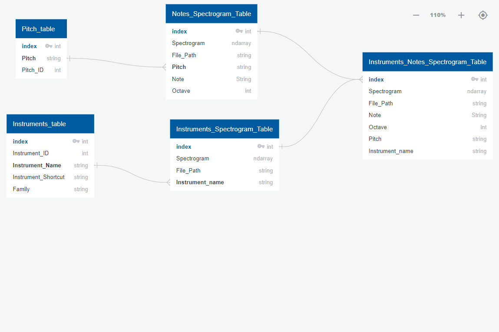

# InstroPitch

> Check [russian documentation](README_ru.md) if needed.

**Objectives**
Use a deep learning neural network to predict a instrument and the note being played.

**Hypothesis**
Can a neural network predict which instrument and note is being played with better than 80% accuracy?

Musical instruments have a wide range of shapes and sizes and the characteristics of one’s sound can just as well be distinct or similar to another instrument. An automatic music instruments recognition will not only distinguish between different types of instruments and their notes, but also may enable music search by instruments, helps recognize musical genres, trains and evaluates music information retrieval (MIR) systems, or can make music transcription easier and more accurate.

**Description of data source:**

[Data Source](https://zenodo.org/record/3685367#.Xo1NVi2ZOuU)

Orginally, this sound data set was recorded for a project called Studio On Line (SOL) at Ircam in Paris (1996-1999). I use the newest version 6.0 updated on Feb, 2020. The data set contains an intrument playing a single musical note. In total, there are 14 different instruments, which are listed below. 

1. Bass Tuba
2. French Horn
3. Trombone
4. Trumpet in C
5. Accordion
6. Contrabass
7. Violin
8. Viola
9. Violoncello
10. Bassoon
11. Clarinet in B-flat
12. Flute
13. Oboe
14. Alto Saxophone

TinySOL Data:

The TinySOL data set contains 2913 audio WAV files at 44.1 kHz. There are 5-fold split of TinySOL. This split has been carefully balanced in terms of instrumentation, pitch range, and dynamics. Each audio file has an instrument playing one musical note. The information of the insturment family and sound, oridinary playing technique, pitch, dynamic, additional information can be found in the file path. Moreover, this information can be found in the metadata as text, which can be furthered cleaned, organized, and analyzed. 

Metadata Data:

The TinySOL_metadata.csv contains text data and information of each path file in the TinySOL. The csv file contains the path, fold ID, instrument family, abbreviation, name, technique abbreviation and name, pitch, pitch ID, dynamic, dynamic ID, instance ID, string ID, and the need for digital retuning. 

**Technology**

[Technology.md](support_info/technology.md)

## Goals and Objectives
The goal and objective is to create a machine learning model to be able to identify the instrument and musical note, and have an accuracy of 80%. Ultimately, I should be able to input a .WAV file, and the musical note and insturment can be identified while the file/sound is being played back. 

## ETL
**Extract:** 
The .wav audio files are extracted from an AWS S3 bucket where the audiofile dataset is stored using python library boto3.

**Transform:**
Each .wav audio file is transformed into a spectrogram using librosa library. The list of spectrograms is then saved to a dataframe called *notes_df*. Also the TinySOL metadata.csv is saved into a dataframe called *tiny_soldf_sample*. The pitch data in this dataframe is transformed, where I used the split function on the pitch column in order to create a notes column and an octave column, that will be used later as inputs in the NN Model.

I then merge the spectrograms dataframe to the metadata dataframe into a dataframe called *notesDf_merged*. I create two new dataframes from this merged dataframe.  The first dataframe is a dataframe that contains the audiofile path, spectrogram, pitch, note, and octave data *(all unnecessary columns are dropped)* and I named it *notesDF_Final*.  The second dataframe is a dataframe that contains the audiofile path, spectrogram and instrument name *(all unnecessary columns are dropped)* and I named it *Instrument_DF_Final*.

**Load:**
The two created dataframe *notesDF_Final* and *Instrument_DF_Final* are are then loaded and saved as tables to PostgresDB using the python library SqLAlchemy.

## Machine Learning Model

**Model Type:**
Convolutional Neural Network (CNN)

**Why use a convolutional neural network (CNN)?** 
Although there are simpler ways to identify pitch (a simple band pass filter), I want to build a model that can be easily modified to identify different sound types (dog barking, keyboard typing, cars, etc.).

**How are you training your model?**
The inputed audio files will be converted into spectograms (arrays). These spectrograms are only input into the CNN. Iwill use two different spectrograms to train two CNNs. The CNN that identifies pitch will be trained with short spectrograms from the middle of the audio file. The CNN that identifies insturments will be trained with longer spectrograms that begin at the start of the audio file.

**What is the model’s accuracy?**
There are currently three working scripts. All have a test accuracy greater than 90% for pitch prediction and greater than 85% for instrument prediction.

**How does this model work?**
- The input: one channel spectrogram 22, 128

**✓ Description of preliminary data preprocessing**
Input: Loaded the spectrogram , and converted series to the numpy array
Output: Took the data from postgress, and converted the categorical columns into numerical column in the dataframe, such as note and instrument.

**✓ Description of preliminary feature engineering and preliminary feature selection, including their decision making process** 
I chose to train with spectrograms because they deconstruct sound signals into their constituent frequencies, and plots them over time. Spectrograms are interpreted as arrays, which can be easily fed into a neural network.

**✓ Description of how data was split into training and testing sets** 
The training and testing sets are into 25 and 75 respectively. Use sklearn.model_selection.train_test_split to split the data. The data is split into training and testing sets into 25 and 75 respectively. I use stratify = <output> to ensure the data is split uniformly.

**✓ Explanation of model choice, including limitations and benefits**
- Benefits: can apply the model to other sound files/signals and make other types of predictions. This model performs well with visual classification problems (spectrograms)
- Limitations: 
 - - It may get a less accuracy when there are lower sample rates because higher frequencies will not be preserved.
 - - Notes played simultaneously, such as chords, may be difficult to identify because the frequncies could deconstruct one another.  
 - - Similar neighboring pixels can often be assumed to belong to the same visual object. However in sound, different frequencies can be neighbors on the spectrogram
 
**Model Output:** 
- Instrument: One out of the 14 instruments listed earlier
- Pitch (note and octave): The musical note letter and the octave number

## Database 

AWS S3 bucket is used to store the audio files (.wav) dataset. The .wav files are extracted from the S3 Bucket and converted into spectrograms. Two dataframes are created, loaded and saved as tables to PostgresDB *(Please refer to ETL Section for more details)*. The two tables create are called *Notes_Spectrogram_Table* and *Instruments_Spectrogram_Table*.  Those two tables are then joined using an sql query to create a third table that contains spectrograms, instruments, and notes data.  

PostGresDB is also used to create tables from original metadata files. 

**Schema Diagram**

